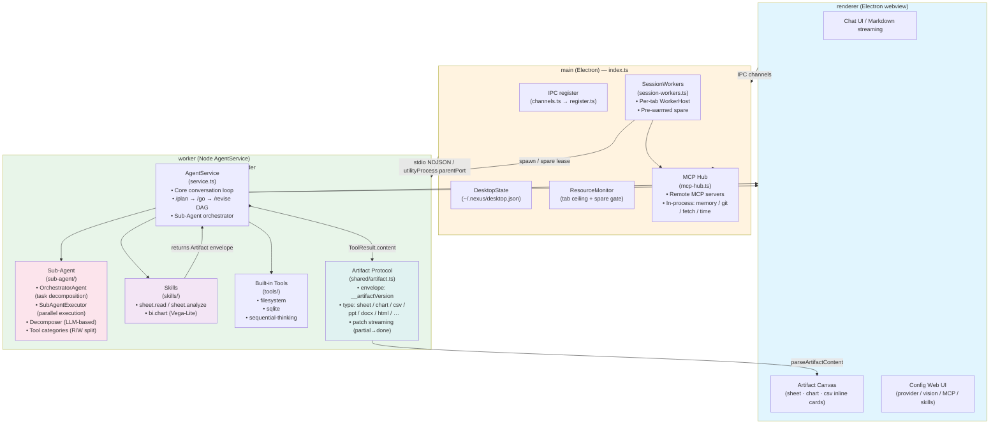

# Nexus Desktop

An Electron desktop front-end for the **Nexus** agent core. It depends on the
published core package (`nexus-coder`) so chat, sessions, tools, MCP,
skills, vision, and permissions behave identically to the CLI — the desktop only
replaces the terminal UI layer.

## Features

- Multi-turn chat with streaming responses, thinking blocks, and tool cards.
- Session history: create, resume, rename, and delete SQLite-backed sessions
  (shared with the CLI's `~/.nexus` data).
- MCP tool support: permission prompts are routed to an in-app modal
  (Allow / Deny), and MCP servers connect in the background so the UI never
  blocks on startup.
- Full provider / vision / OCR / MCP / skills configuration via an embedded
  copy of the core's configuration Web UI.
- Message queueing: messages sent while the agent is busy are shown immediately
  and auto-submitted one-by-one after the current turn completes.
- Multi-tab sessions: every open tab runs in its own worker process, so
  streaming one tab never blocks another and each tab keeps its own workspace
  (`cwd`) and provider/model overrides.
- Fast tab opening: a pre-warmed, session-unbound spare worker is kept ready when
  system resources allow, so the common open-tab path skips a cold process
  spawn + Agent construction (gated on the resource monitor + tab ceiling).
- **Sub-Agent parallel execution**: complex requests are decomposed by an
  `OrchestratorAgent` into independent sub-tasks that run in isolated worker
  processes concurrently (with dependency resolution, concurrency limits, and
  graceful fallback to serial).
- **Skill / Artifact pipeline (M0)**: office skills (`sheet.analyze`,
  `bi.chart`) produce structured `Artifact` payloads that render inline as
  Vega-Lite charts, CSV tables, and markdown cards directly in the chat stream.
- Clipboard image pasting: `Alt+V` (mirroring coder-core) attaches a clipboard
  screenshot / image to the input; native image pastes are detected too.
- Windows installer with a branded icon.

## Architecture



### Process model

- The core **Agent** always runs in a separate worker process — never inside
  Electron's main process — keeping native modules (`better-sqlite3`) on a stable
  ABI and isolating core crashes from the UI.
- **Dev / npm-install** transport: worker is spawned as a system `node` child,
  JSON-RPC over stdio.
- **Packaged exe** transport: worker is an Electron `utilityProcess` using
  `parentPort`, line-based JSON-RPC.
- **Tab workers**: each open session tab owns its own `WorkerHost` process
  (same `agent-worker.js`, bound to one concrete session via `startSession`).
  Playing/streaming one tab never blocks another.
- **Pre-warmed spare**: a session-unbound worker pre-created when the resource
  monitor reports healthy and tabs are below the ceiling. It is never attached to
  a session until a tab actually opens, so it can never be mistaken for an idle
  process carrying an in-flight turn. Taken atomically by `open()`/`openNew()`;
  refilled on tab close.
- **MCP hub**: all MCP server connections/spawning are owned by a single
  main-process `mcp-hub`; every worker proxies tool calls through it (one OS
  process per server — no per-tab shadow processes). Built-in tools
  (filesystem / sqlite / sequential-thinking) run in-process via a unified
  registry (`src/tools/`).
- **In-process built-ins** (`mcp-hub.ts`): `memory`, `git`, `fetch`, `time`
  servers are replaced by single-process implementations; their names are
  shadowed in the settings UI so they show as "connected" without spawning
  external processes.
- **Sub-Agent parallelism** (`src/agent/sub-agent/`):
  - `OrchestratorAgent` decomposes a prompt via LLM into `SubTask[]` with
    dependency edges.
  - `SubAgentExecutor` runs independent tasks concurrently (default fan-out = 4,
    total timeout = 5 min), topologically sorts dependent tasks, and aggregates
    results.
  - Failed sub-tasks fall back gracefully; partial failure returns succeeded
    results alongside error reports.
- **Artifact pipeline** (`src/shared/artifact.ts` + `src/renderer/artifacts/`):
  Skill results embed a JSON envelope (`{"__artifactVersion":1,"artifact":{…}}`)
  inside `ToolResult.content`. The renderer parses it with
  `parseArtifactContent()` and dispatches to type-specific view components
  (`chart-view.ts`, `table-view.ts`). Export via `nexus:saveArtifact` dialog.
- The app shares `~/.nexus` (sessions DB + session config) with the CLI; it does
  **not** depend on the CLI binary.

## Source layout

```
src/
  main/           Electron bootstrap (index.ts), WorkerHost, per-tab SessionWorkers,
                  MCP hub, desktop state store (src/main/desktop-state.ts),
                  in-process tools (memory-kg / git-internal / fetch-tools / time-tools)
  ipc/            channel constants (channels.ts) + registerIpc handlers (register.ts)
  agent/          AgentService + shared bridge types
    service.ts    core conversation loop, /plan /go /revise DAG, sub-agent wiring
    sub-agent/    OrchestratorAgent, SubAgentExecutor, Decomposer, types, metrics
  tools/          built-in tool registries (filesystem / sqlite / sequential-thinking)
  skills/         artifact-producing skills (sheet / chart)
  renderer/       renderer UI, i18n, markdown streaming, artifact renderers
    artifacts/    artifact-view / chart-view / table-view / vega
  shared/         IPC validation spec, Artifact protocol, runtime constants, logger
  agent-service.ts  thin re-export facade (preserves dist/agent-service.js path)
```

## Dependencies

- `nexus-coder` - Nexus CLI core (includes all transitive dependencies)
- `electron-updater` - Auto-update support
- `exceljs` - M0: spreadsheet read/analyze skill
- `vega` / `vega-lite` / `vega-embed` - M0: chart skill + inline rendering

## Source mirror

The source (`main` + tags) is auto-mirrored to Gitee on every push
 (`.github/workflows/gitee-sync.yml`), and releases are published on both hosts:

- GitHub: https://github.com/jsws9517/nexus-desktop
- Gitee mirror: https://gitee.com/cict_1_0/nexus-desktop

Installer binaries (~110 MiB) are GitHub-only because Gitee caps release
attachments at 100 MiB.

## Getting started

```bash
npm install          # on CN networks: ELECTRON_MIRROR=https://npmmirror.com/mirrors/electron/ npm install
npm start            # build + launch in dev mode
```

`npm start` requires an API key configured (see the Settings window).

## Scripts

| Command             | Purpose                                              |
| ------------------- | ---------------------------------------------------- |
| `npm run build`     | compile TS, copy static assets                        |
| `npm start`         | build + run Electron in dev                          |
| `npm run typecheck` | type-check                                           |
| `npm run test:unit` | headless unit suite (`node --test`, incl. IPC + tools) |
| `npm run test:smoke`| headless RPC smoke test (no GUI, no LLM)             |
| `npm run test:chat` | headless end-to-end chat through the worker          |
| `npm run test:work` | work-mode test (DAG plan/go/revise)                   |
| `npm run dist:win`  | build the Windows `.exe` installer                 |

## Packaging

- `npm run dist:win` → `release/nexus Setup X.Y.Z.exe` (electron-builder
  NSIS). On CN networks set:
  - `ELECTRON_MIRROR=https://npmmirror.com/mirrors/electron/`
  - `ELECTRON_BUILDER_BINARIES_MIRROR=https://npmmirror.com/mirrors/electron-builder-binaries/`
- `npm run pack:npm` → a global-install tarball (`npm install -g <tarball>`),
  which launches the GUI under the system Node ABI.
- The core is installed from npmjs.com (`nexus-coder`), no special registry needed.
- Auto-update checks GitHub Releases and falls back to gh-proxy CDN mirrors when
  GitHub is unreachable. To force a custom feed (e.g. a self-hosted generic
  update server), set the `NEXUS_UPDATE_MIRROR` env var to the feed base URL.
- `better-sqlite3` must be rebuilt to the correct ABI for the target runtime:
  - Dev / system node: `npm rebuild better-sqlite3`
  - Electron / packaged: `npx @electron/rebuild -f -w better-sqlite3`

## Troubleshooting

- **IPC/preload silently missing** — `window.nexusDesktop` is `undefined` and
  the session list never renders, with
  `Main process: renderer[3]: SyntaxError: Cannot use import statement outside a module`
  in the log. The main-window preload (`dist/preload.js`) is ESM
  (`"type": "module"`), but Electron's **sandboxed** preloads only support
  CommonJS, so `sandbox: true` makes the preload fail to load. Keep the main
  window at `sandbox: false`; if sandboxing is required, compile the preload to
  a CommonJS bundle first (see C3 in `docs/development-requirements.md`).
- **Permission popup hangs / Allow does nothing** — ensure the worker's
  `permission` message id is forwarded correctly (`worker-host.ts` maps the
  `id` field); the id is how the renderer answers back.
- **Packaged app can't `dlopen better-sqlite3`** means the ABI is wrong — rebuild
  with `@electron/rebuild` and re-couple the package.
- **Menu bar on top.** The default Electron menu is removed via
  `Menu.setApplicationMenu(null)`.
