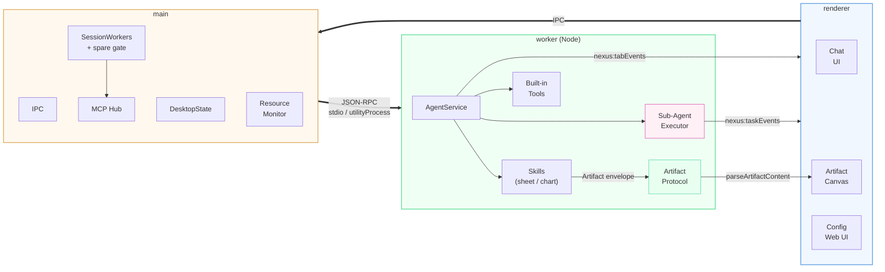

# Nexus Desktop

**Nexus** 智能体核心的 Electron 桌面端。依赖已发布的 `nexus-coder` 核心包，会话、工具、MCP、技能、视觉与权限行为与 CLI 完全一致——桌面端只是替换掉终端 UI 层。

## 功能特性

- 多轮对话：流式响应、思考块、工具卡片。
- 会话历史：创建、恢复、重命名、删除 SQLite 会话（与 CLI 共享 `~/.nexus` 数据）。
- MCP 工具支持：权限请求通过应用内弹窗（允许 / 拒绝）路由；MCP 服务器后台连接，UI 启动不被阻塞。
- 完整配置：内置核心的配置 Web UI，可配置 provider / 视觉 / OCR / MCP / 技能。
- 消息排队：agent 繁忙时发送的消息立即上屏，当前轮次结束后逐条自动提交。
- 多标签会话：每个标签页运行在独立 worker 进程中，一个标签的流式输出不会阻塞其他标签，各标签保持独立的 `cwd` 与 provider/model 覆盖。
- 快速开标签：系统资源允许时预置一个**未绑定会话**的备用 worker，常见开标签路径跳过冷启动（进程 spawn + Agent 构造），并受资源监控与标签上限门禁。
- **Sub-Agent 并行执行**：复杂请求由 `OrchestratorAgent` 经 LLM 分解为多个独立子任务，在各隔离 worker 进程中并发执行（支持依赖排序、并发上限控制、失败 graceful fallback）。
- **Skill / Artifact 流水线（M0）**：办公技能（`sheet.analyze`、`bi.chart`）返回结构化 `Artifact` 负载，直接以内联卡片形式渲染为 Vega-Lite 图表、CSV 表格或 markdown 内容。
- 剪切板贴图：按 `Alt+V`（与 coder-core 一致）把剪切板截图/图片作为附件加入输入框；原生图片粘贴也会被识别。
- Windows 安装包：带品牌图标。

## 架构



### 进程模型

- 核心 **Agent** 始终运行在独立 worker 进程中——绝不在 Electron 主进程内执行——从而让原生模块（`better-sqlite3`）保持稳定 ABI，并将核心崩溃与 UI 隔离。
- **开发 / npm 安装**传输：worker 以系统 `node` 子进程方式 spawn，基于 stdio 的 JSON-RPC。
- **打包 exe** 传输：worker 是 Electron `utilityProcess`，走 `parentPort`，逐行 JSON-RPC。
- **标签 worker**：每个打开的会话标签拥有独立的 `WorkerHost` 进程（同一份 `agent-worker.js`，通过 `startSession` 绑定到具体会话）。一个标签的播放/流式不会阻塞其他标签。
- **预热备用 worker**：当资源监控状态健康且标签数低于上限时，预创建一个未绑定会话的 worker。它直到某个标签真正打开才被绑定，因此不可能被误判为"携带进行中轮次的空闲进程"。由 `open()`/`openNew()` 原子接管，关闭标签时自动补位。
- **MCP 总线（hub）**：所有 MCP 服务器的连接与启动统一由主进程 `mcp-hub` 持有，各 worker 通过它代理工具调用（每服务器一个 OS 进程——无 per-tab 影子进程）。内置工具（文件系统 / sqlite / 顺序思考）通过统一注册表（`src/tools/`）在进程内运行。
- **进程内内置服务**（`mcp-hub.ts`）：`memory`、`git`、`fetch`、`time` 四个 MCP 服务器由主进程内的单进程实现替代，设置 UI 中显示为"已连接"，无需 spawn 外部进程。
- **Sub-Agent 并行**（`src/agent/sub-agent/`）：
  - `OrchestratorAgent` 通过 LLM 将 prompt 分解为带依赖边的 `SubTask[]`。
  - `SubAgentExecutor` 并发运行独立任务（默认并发上限 4，总超时 5 分钟），对有依赖的任务做拓扑排序，并聚合结果。
  - 部分失败时优雅降级：已成功子任务的结果一并返回，失败子任务附带错误报告。
- **Artifact 流水线**（`src/shared/artifact.ts` + `src/renderer/artifacts/`）：
  Skill 结果以 JSON 信封（`{"__artifactVersion":1,"artifact":{…}}`）嵌入 `ToolResult.content`。渲染器通过 `parseArtifactContent()` 解析后，分发给类型特定的视图组件（`chart-view.ts`、`table-view.ts`）。导出通过 `nexus:saveArtifact` 对话框完成。
- 应用与 CLI 共享 `~/.nexus`（会话 DB + 会话配置），**不依赖** CLI 二进制。

## 源码结构

```
src/
  main/           Electron 引导（index.ts）、WorkerHost、按标签的 SessionWorkers、
                  MCP hub、桌面状态存储（desktop-state.ts）、
                  进程内工具（memory-kg / git-internal / fetch-tools / time-tools）
  ipc/            频道常量（channels.ts）+ registerIpc 处理器（register.ts）
  agent/          AgentService 与共享桥接类型
    service.ts    核心对话循环、/plan /go /revise DAG、Sub-Agent 接线
    sub-agent/    OrchestratorAgent、SubAgentExecutor、Decomposer、类型定义、指标
  tools/          内置工具注册表（文件系统 / sqlite / 顺序思考）
  skills/         Artifact 生产型技能（sheet / chart）
  renderer/       渲染器 UI、i18n、markdown 流式渲染、artifact 渲染器
    artifacts/    artifact-view / chart-view / table-view / vega
  shared/         IPC 校验规范、Artifact 协议、运行时常量、日志
  agent-service.ts  薄包装再导出（保留 dist/agent-service.js 路径）
```

## 依赖

- `nexus-coder` — Nexus CLI 核心（含全部传递依赖）
- `electron-updater` — 自动更新支持
- `exceljs` — M0：电子表格读取/分析技能
- `vega` / `vega-lite` / `vega-embed` — M0：图表技能 + 前端内联渲染

## 源码镜像

源码（`main` + tags）在每次推送时自动同步到 Gitee（`.github/workflows/gitee-sync.yml`），发布同时发布于两个平台：

- GitHub：https://github.com/jsws9517/nexus-desktop
- Gitee 镜像：https://gitee.com/cict_1_0/nexus-desktop

安装包二进制（约 110 MiB）仅发布在 GitHub，因为 Gitee 对附件上限为 100 MiB。

## 快速开始

```bash
npm install          # 国内网络：ELECTRON_MIRROR=https://npmmirror.com/mirrors/electron/ npm install
npm start            # 构建并启动开发模式
```

`npm start` 需要先在设置窗口配置 API key。

## 脚本

| 命令                | 说明                                                 |
| ------------------- | ---------------------------------------------------- |
| `npm run build`     | 编译 TS，拷贝静态资源                                 |
| `npm start`         | 构建并运行 Electron 开发模式                          |
| `npm run typecheck` | 类型检查                                             |
| `npm run test:unit` | 无头单元测试（`node --test`，含 IPC 与内置工具）      |
| `npm run test:smoke`| 无头 RPC 冒烟测试（无 GUI、无 LLM）                   |
| `npm run test:chat` | 通过 worker 的无头端到端对话                         |
| `npm run test:work` | Work mode 测试（DAG plan/go/revise）                  |
| `npm run dist:win`  | 构建 Windows `.exe` 安装包                            |

## 打包

- `npm run dist:win` → `release/nexus Setup X.Y.Z.exe`（electron-builder NSIS）。国内网络建议设置：
  - `ELECTRON_MIRROR=https://npmmirror.com/mirrors/electron/`
  - `ELECTRON_BUILDER_BINARIES_MIRROR=https://npmmirror.com/mirrors/electron-builder-binaries/`
- `npm run pack:npm` → 全局安装 tarball（`npm install -g <tarball>`），在系统 Node ABI 下启动 GUI。
- 核心从 npmjs.com 安装（`nexus-coder`），无需特殊 registry。
- 自动更新检查 GitHub Releases，GitHub 不可达时回退到 gh-proxy CDN 镜像。如需强制自定义源（例如自托管通用更新服务器），设置 `NEXUS_UPDATE_MIRROR` 环境变量为源地址。
- `better-sqlite3` 必须按目标运行时重建到正确的 ABI：
  - 开发 / 系统 node：`npm rebuild better-sqlite3`
  - Electron / 打包：`npx @electron/rebuild -f -w better-sqlite3`

## 故障排查

- **IPC/preload 静默缺失** —— `window.nexusDesktop` 为 `undefined` 且会话列表不渲染，日志出现
  `Main process: renderer[3]: SyntaxError: Cannot use import statement outside a module`。
  主窗口 preload（`dist/preload.js`）是 ESM（`"type": "module"`），但 Electron **沙箱化** preload
  仅支持 CommonJS，因此 `sandbox: true` 会导致 preload 加载失败。主窗口保持 `sandbox: false`；
  如需强制沙箱，需先把 preload 编译为 CommonJS 产物（见 `docs/development-requirements.md` 中 C3）。
- **权限弹窗卡住 / 点"允许"无效** —— 确认 worker 的 `permission` 消息 id 被正确转发
  （`worker-host.ts` 映射 `id` 字段）；该 id 是 renderer 回应的依据。
- **打包应用无法 `dlopen better-sqlite3`** —— ABI 不匹配，用 `@electron/rebuild` 重建并重新耦合依赖。
- **顶部菜单栏** —— 通过 `Menu.setApplicationMenu(null)` 移除了 Electron 默认菜单。
